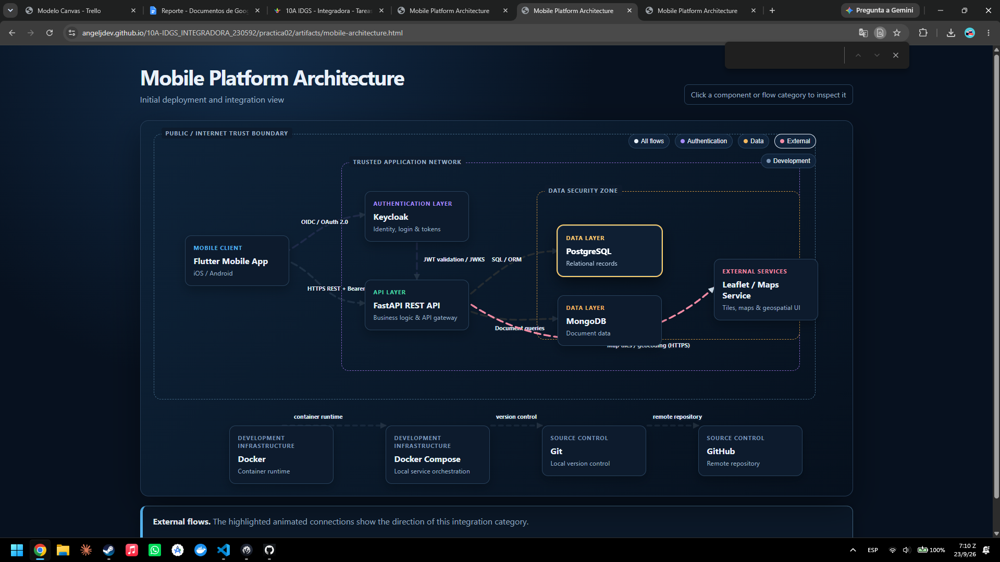

# Practica 02 - Arquitectura de la aplicacion movil

## Objetivo

Documentar la arquitectura de una aplicacion movil mediante un modelo interactivo que muestra componentes, limites de confianza y flujos entre autenticacion, API, datos, servicios externos y herramientas de desarrollo.

## Evidencia visual

La siguiente captura muestra el modelo publicado en GitHub Pages, incluyendo los componentes, los limites de confianza, las categorias de flujo y el panel de explicacion interactivo.

El diagrama permite seleccionar componentes y categorias de flujo. Las flechas indican la direccion de comunicacion entre el origen y el destino; el panel inferior explica la responsabilidad del elemento seleccionado.

## Descripcion de la arquitectura

La aplicacion movil se organiza en cuatro areas principales:

1. **Cliente movil:** la aplicacion Flutter funciona en iOS y Android y solicita autenticacion antes de consumir la API.
2. **Red de aplicacion confiable:** Keycloak administra la identidad y FastAPI concentra la logica de negocio y el acceso a servicios.
3. **Zona de seguridad de datos:** PostgreSQL conserva registros relacionales y MongoDB conserva documentos flexibles.
4. **Infraestructura y control de codigo:** Docker y Docker Compose ejecutan el entorno local; Git y GitHub mantienen el historial y el repositorio remoto.

## Limites de confianza

- **Public / Internet Trust Boundary:** separa el cliente y los servicios externos de la red interna.
- **Trusted Application Network:** contiene la autenticacion, la API y las conexiones internas de la aplicacion.
- **Data Security Zone:** restringe el acceso a las bases de datos desde la capa de servicios.

## Comportamiento interactivo

- Los botones superiores filtran los flujos de autenticacion, datos, servicios externos y desarrollo.
- Las lineas animadas y sus puntas de flecha muestran la direccion de cada comunicacion.
- Al seleccionar un cuadro se resalta el componente y se muestra una explicacion de su funcion.
- El modelo puede consultarse directamente desde GitHub Pages sin instalar dependencias.

## Archivos de soporte

- `artifacts/mobile-architecture.html`: implementacion del modelo interactivo.
- `artifacts/mobile-architecture.json`: estructura del diagrama.
- `artifacts/mobile-architecture.delivery.json`: metadatos de entrega.
- `artifacts/mobile-architecture.visual-check.json`: comprobaciones visuales.
- `Reporte.pdf`: documento de evidencias.

## Componentes documentados

- Aplicacion movil Flutter para iOS y Android.
- Keycloak para identidad, inicio de sesion y tokens.
- API REST desarrollada con FastAPI.
- PostgreSQL y MongoDB para almacenamiento de datos.
- Leaflet o servicio de mapas para funciones geoespaciales.
- Docker y Docker Compose para el entorno de desarrollo.
- Git y GitHub para control de versiones y repositorio remoto.

## Flujos principales

- Autenticacion mediante OIDC y OAuth 2.0.
- Comunicacion de la aplicacion con la API mediante HTTPS, REST y JWT.
- Validacion de tokens con JWKS.
- Consultas de datos SQL y documentales.
- Consumo de mapas y geocodificacion mediante HTTPS.
- Control de versiones local y sincronizacion con GitHub.

## Evidencias y validacion

El archivo de entrega y las verificaciones visuales respaldan la publicacion del modelo:

- `mobile-architecture.delivery.json` registra los archivos y metadatos de entrega.
- `mobile-architecture.visual-check.json` registra las comprobaciones visuales.
- Las capturas PNG muestran el resultado en resoluciones de escritorio y temas claro y oscuro.
- `Reporte.pdf` contiene el documento de evidencias de la practica.

## Interactivo

https://angeljdev.github.io/10A-IDGS_INTEGRADORA_230592/practica02/artifacts/mobile-architecture.html
