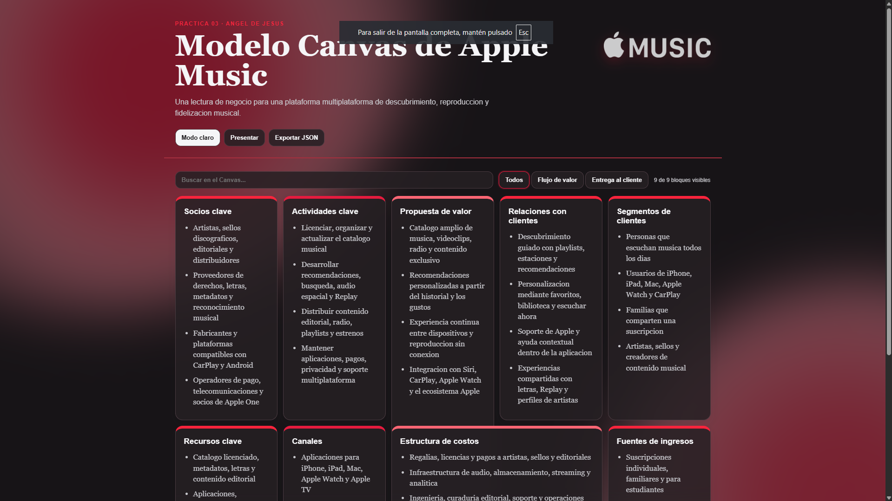

# Practica 03 - Modelo Canvas de Apple Music

## Objetivo

Crear, revisar y documentar un Modelo Canvas de negocio para una aplicacion multiplataforma de uso cotidiano.

## Aplicacion seleccionada

**Apple Music**, plataforma multiplataforma para descubrir, reproducir y compartir musica.

## Evidencia visual

La vista presenta los nueve bloques del Modelo Canvas, busqueda, filtros por flujo y tarjetas con informacion detallada. La interfaz usa una paleta inspirada en Apple Music, modo claro y oscuro, y un fondo animado suave.

## Actividades cubiertas

1. Se eligio Apple Music como aplicacion multiplataforma de uso cotidiano.
2. Se estructuro el prompt para generar los nueve bloques del Canvas.
3. Se reviso el modelo, se eliminaron duplicados y se mejoro la redaccion.
4. Se agregaron senales de negocio para hacer verificable cada bloque.
5. Se implemento una vista interactiva con busqueda, filtros y detalle expandible.
6. Se documentaron el prompt, el modelo estructurado y la evidencia visual en el repositorio.

## Archivos de soporte

- `prompt.md`: instrucciones utilizadas para generar el modelo.
- `modelo-canvas.json`: estructura de los nueve bloques y sus detalles.
- `modelo-canvas.html`: implementacion de la vista interactiva.

## Interactivo

https://angeljdev.github.io/10A-IDGS_INTEGRADORA_230592/practica03/modelo-canvas.html
